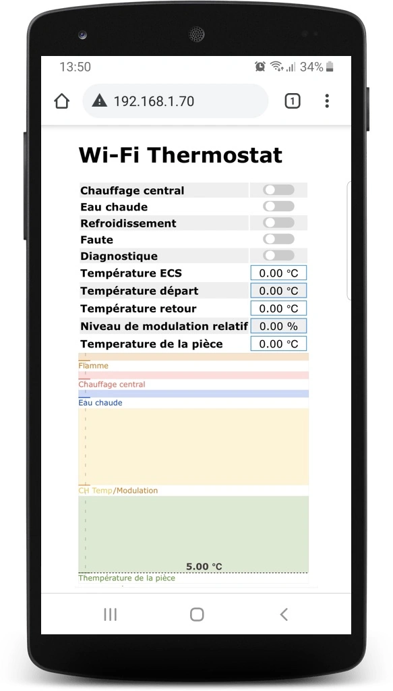

# ESP8266 Wi-Fi OpenTherm Thermostat

ESP8266 Wi-Fi OpenTherm Thermostat sketch allows you to build simple OpenTherm Wi-Fi thermostat using ESP32 module and [ESP32/ESP8266 Thermostat Shield](https://diyless.com/product/esp8266-thermostat-shield).

Detailed instructions you can find in [ESP32 Wi-Fi OpenTherm Thermostat](https://diyless.com/blog/esp32-wifi-thermostat) post of [diyless.com](https://diyless.com/Blog) blog.

## ESP8266 Wi-Fi OpenTherm Thermostat Web Server

Passage en français + ajout des températures de sortie et d'entrée (retour) du chauffage.

## License
Copyright (c) 2020 [DIYLESS](http://diyless.com/). Licensed under the [MIT license](/LICENSE?raw=true).

